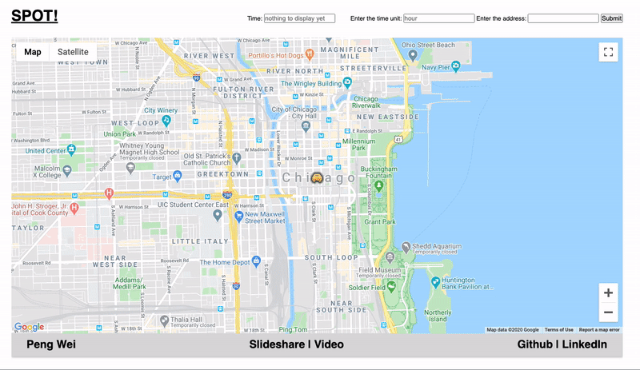
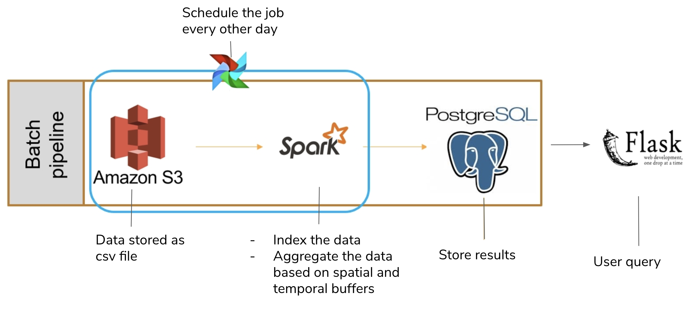

# Spot!

> ***Spatial parking optimized tracking system to avoid parking ticket***

This is a project I completed during the Insight Data Engineering program (Boston, Summer 2020).
Visit [datapipeline.online](http://datapipeline.online) to see it in action (or watch it [here](https://www.youtube.com/watch?v=SEieUv3eGAM)).

## Table of Contents

1. [Usage](README.md#Usage)
1. [System](README.md#System)
1. [Data Source](README.md#Data-Source)
1. [Setup](README.md#setup)
1. [Starting the pipeline](README.md#starting-the-pipeline)
1. [Contact Information](README.md#contact-information)

***

## Usage

This project aim to provide the drivers if the location has highter than average rate of parking citations or not. 

Red means that the number of parking citation is more than 1.5 x of the average in the 250 * 250 m^2 spatial buffer given some time unit buffer. Yellow means the number of parking citation is between 0.8 x and 1.5 x.Green means that the number of parking citation is less than 0.8 x.

The system requires three inputs. 
- Timestamp's format is "yyyy-mm-dd hh:mm:ss". 
- Time units (hour, week day, week of month, day of month). 
- Address

For example, the first query above means that 1 pm parking near the University of Chicago is more likely to get a parking ticket compared to the other hours.

## System
---
100 GB parking ticket data is stored in S3 bucket. Spark fetch the data, add the spatial index and abstract the useful time information, then aggregate the data based on spatial and temporal buffers. Store the result into postgres. 

## Data Sources

  [Chicago parking tickets](https://www.propublica.org/datastore/dataset/chicago-parking-ticket-data)

## Setup

Install and configure [AWS CLI](https://aws.amazon.com/cli/) and [Pegasus](https://github.com/InsightDataScience/pegasus) on your local machine, and clone this repository using
`git clone https://github.com/AndreyBozhko/TaxiOptimizer`.

### CLUSTER STRUCTURE:

To reproduce my environment, 11 m4.large AWS EC2 instances are needed:

- (4 nodes) Spark Cluster - Batch
- (1 node) PostgreSQL
- Flask Node

To create the clusters, put the appropriate `master.yml` and `workers.yml` files in each `cluster_setup/<clustername>` folder (following the template in `cluster_setup/dummy.yml.template`), list all the necesary software in `cluster_setup/<clustername>/install.sh`, and run the `cluster_setup/create-clusters.sh` script.

##### Airflow setup

The Apache Airflow scheduler can be installed on the master node of *spark-batch-cluster*. Follow the instructions in `docs/airflow_install.txt` to launch the Airflow server.

##### PostgreSQL setup
The PostgreSQL database sits on the master node of *spark-stream-cluster*.
Follow the instructions in `docs/postgres_install.txt` to download and setup access to it.

##### Configurations
Configuration settings for Kafka, PostgreSQL, AWS S3 bucket, as well as the schemas for the data are stored in the respective files in `config/` folder.

## Running System

### Schedule the Batch Job
Running `airflow/schedule.sh` on the master of *spark-batch-cluster* will add the batch job to the scheduler. The batch job is set to execute every 24 hours, and it can be started and monitored from the Airflow GUI at `http://$SPARK_BATCH_CLUSTER_0:8081`.

### Start the Streaming Job
Execute `./spark-run.sh --stream` on the master of *spark-stream-cluster* (preferably after the batch job has run for the first time).

### Start streaming messages with Kafka
Execute `./kafka-run --produce` on the master of *kafka-cluster* to start streaming the real-time taxi location data.
If the topic does not exist, run `./kafka-run --create`. To describe existing topic, run `./kafka-run --describe`.
It is also possible to delete inactive topic using the option `--delete`, or view the messages in the topic with the option `--console-consume`.

### Flask
Create the file `config/GoogleAPIKey.config` with your Google Maps API key, and run `flask/run.sh` to start the Flask server.

### Testing
The folder `test/` contains unit tests for various project components.